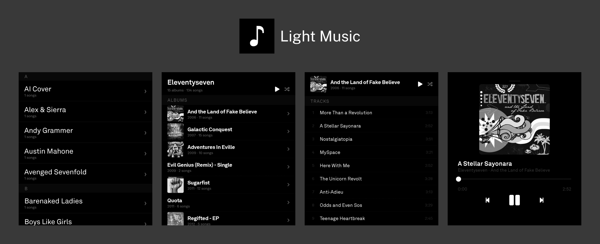

A minimal music app for the Light Phone 3.

## Features

- Automatic Light Phone Music detection
- Attach Album Art thats scrubbed by Light Phone's Upload
- General Music App Features

## Planned features

- More stripped back UI to match Light Phone

## Known issues

## Installation

The latest APK is available in [releases](https://github.com/dryane/light-music/releases/).

I recommend using [Obtainium](https://github.com/ImranR98/Obtainium) and adding the repository's URL to receive updates.

## Acknowledgements

Thanks [Vandam](https://github.com/vandamd) for creating [light-template](https://github.com/vandamd/light-template), which i used initially to set up a lot of the structure, even though i diveged early on
